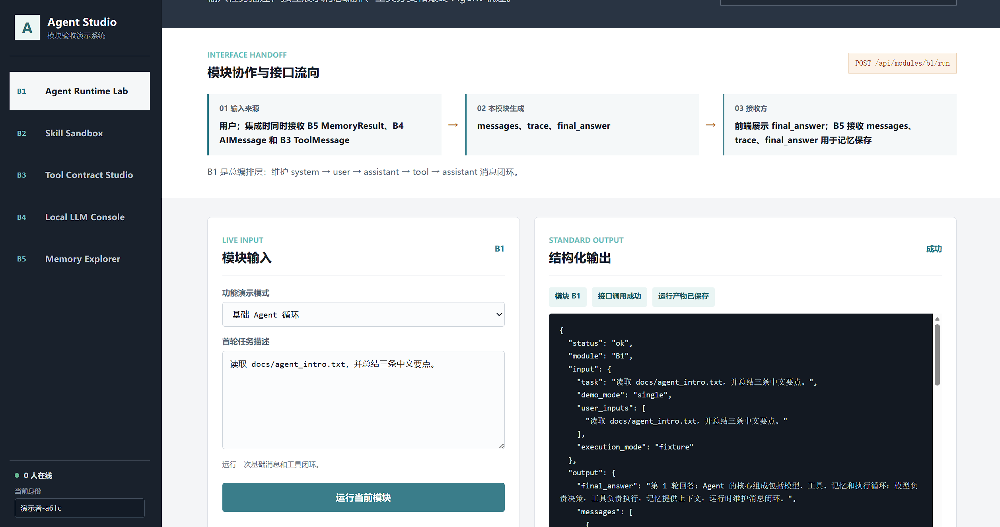
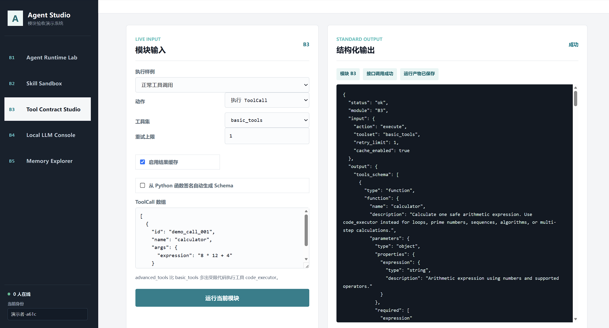
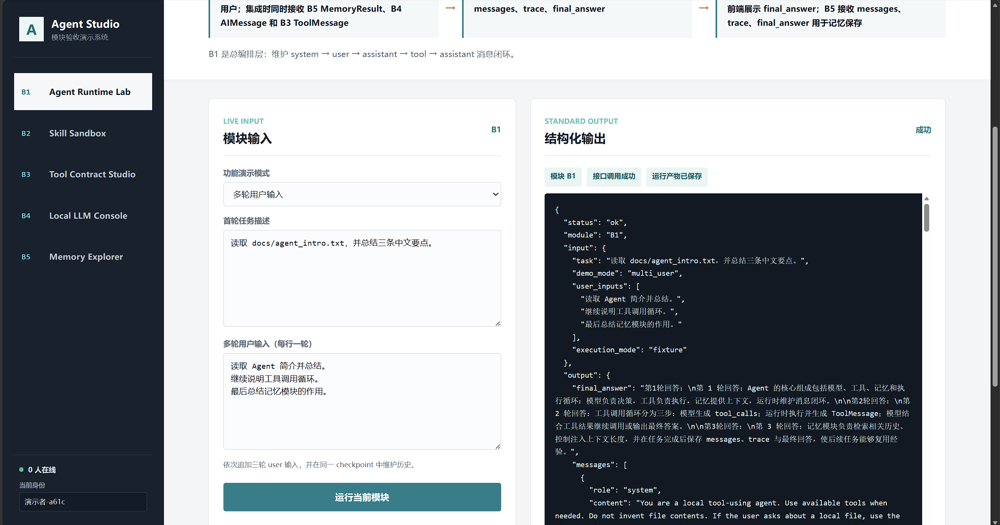
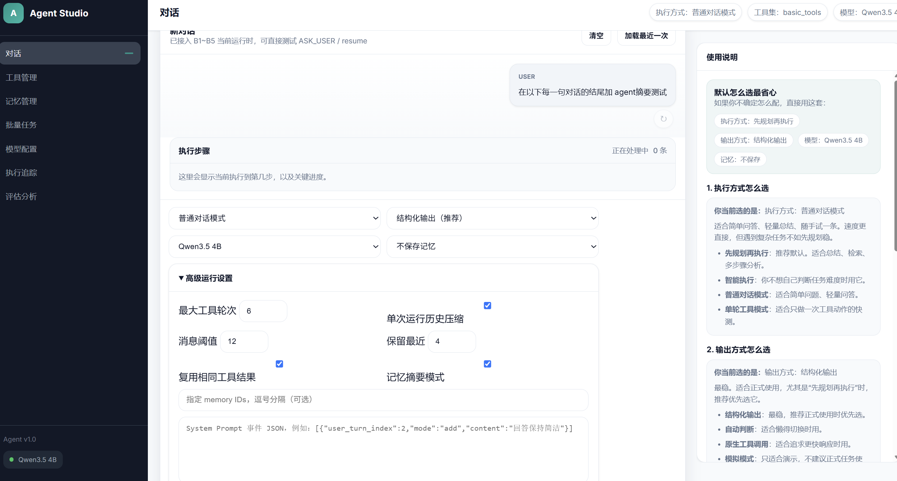
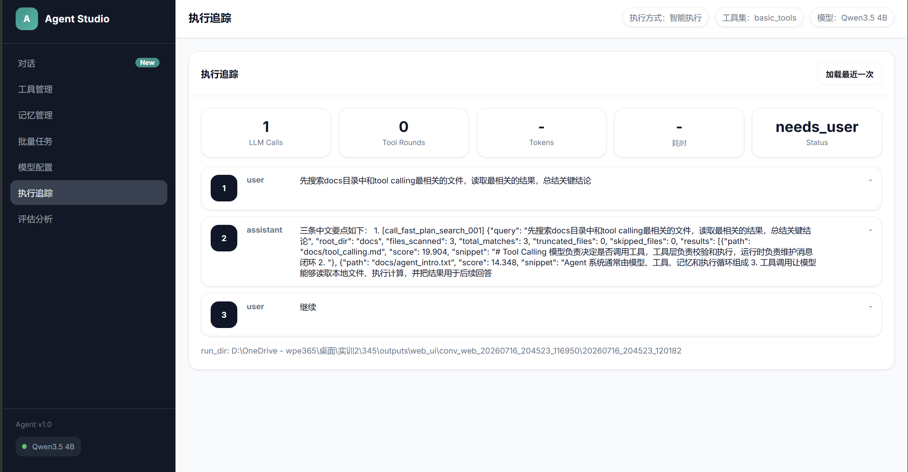

# B1/B3 个人模块 README

| 项目 | 内容 |
|---|---|
| 姓名 | 王瀚樟 |
| 班级 | 人工智能 2301 |
| 学号 | 20236472 |
| 小组 | 第三组 |
| 负责模块 | B1 Agent Runtime、B3 Tool Layer |

---

## 1. 模块概述

### 1.1 模块名称

- `B1 Agent Runtime`：Agent 消息与执行循环。
- `B3 Tool Layer`：模型 ToolCall 与本地 Skill 之间的工具契约层。

### 1.2 模块说明

B1 是完整 Agent 系统的调度中心。它读取 Runtime JSON，组织 `system/user/assistant/tool` 消息，调用 B5 加载记忆、调用 B3 获取工具 Schema、调用 B4 生成 AIMessage，再根据 `tool_calls` 决定是否继续工具循环。B1 最终输出完整消息、运行轨迹、checkpoint 和最终回答。

B3 是 B4 与 B2 之间的适配层。它从 `configs/tools.yaml` 生成 Tools Schema，校验工具名与参数，调用 B2 Skill，再把 `SkillResult` 封装为带 `tool_call_id` 的标准 `ToolMessage`。B3 同时负责结果缓存、可恢复错误重试、JSONL 日志与调用统计。

两个模块共同解决了“模型会决策，但不能直接、可靠地执行本地工具”的问题：B1 管理过程与状态，B3 保证每次工具交互结构化、可追踪、可恢复。

### 1.3 完成情况概览

| 类型 | 完成情况 |
|---|---|
| 基础要求 | 已完成 B1 标准消息循环、轮次限制、结果落盘；已完成 B3 Schema 生成、参数校验、Skill 调用和 ToolMessage 封装。 |
| 进阶要求 | B1 已实现多轮/多工具循环、四种 Agent 模式、断点恢复、人工确认、历史压缩、System Prompt 事件、批量与端到端评测；B3 已实现自动 Schema、缓存、重试、统计和批量评测接口。 |
| 可独立运行的演示 | `python module_demos/run_all_demo.py`，浏览器访问 `http://127.0.0.1:8100/#b1` 或 `#b3`；也可直接运行 B1/B3 CLI。 |
| 与团队系统集成情况 | Agent Studio Web 调用 B1；B1 调用 B3/B4/B5；B3 内部调用 B2，已跑通完整闭环。 |

---

## 2. 环境、模型与数据依赖

### 2.1 运行环境

| 项目 | 要求 |
|---|---|
| Python 版本 | Python 3.10（项目验证版本） |
| 必要依赖 | 基础独立演示为 Python 标准库 + PyYAML；完整系统使用 `requirements.txt` |
| 是否需要模型 | B1 fixture 和 B3 独立演示不需要；B1 真实集成推理需要 |
| 是否需要 GPU | fixture/mock/B3 不需要；`prompt_json` 或 `native_tools` 真实推理推荐 NVIDIA GPU |
| 是否需要外部数据集 | 不需要，使用项目内自构造样例 |

### 2.2 模型依赖

B3 本身不加载模型；B1 只在与 B4 集成且选择真实推理模式时依赖模型。

| 模型 | 来源 | 项目内相对路径 | 用途 |
|---|---|---|---|
| Qwen3.5-4B | `https://huggingface.co/Qwen/Qwen3.5-4B` | `models/Qwen3.5-4B/` | B1 集成 B4 后的 `prompt_json` / `native_tools` 推理 |

Windows 下可使用 Hugging Face CLI 下载：

```powershell
$env:HF_ENDPOINT = "https://hf-mirror.com"
hf download Qwen/Qwen3.5-4B --local-dir .\models\Qwen3.5-4B
```

下载后将 `configs/model.yaml` 中默认 profile 的 `model_name_or_path` 和 `tokenizer_name_or_path` 指向 `../models/Qwen3.5-4B`。

### 2.3 数据集或样例数据依赖

| 数据或文件 | 来源 | 项目内相对路径 | 用途 |
|---|---|---|---|
| B1 fixture | 团队自行构造 | `data/b1_fixtures/` | 隔离 B2—B5，验证 B1 完整消息闭环 |
| B1 进阶用例 | 团队自行构造 | `data/b1_cases/` | 多轮、多工具、断点恢复、历史压缩、Prompt 切换 |
| B3 ToolCall 样例 | 团队自行构造 | `data/messages/b3_tool_call*.json` | 正常调用、缺参、未知工具和统计用例 |
| 工具目标数据 | 团队自行构造 | `data/docs/`、`data/tables/` | 文件读取、检索和表格分析 |
| 工具配置 | 项目自带 | `configs/tools.yaml` | 定义工具集、参数 Schema、返回字段与 `data_root` |

### 2.4 安装步骤

```powershell
# 在项目根目录执行
py -3.10 -m venv .venv
.\.venv\Scripts\Activate.ps1
python -m pip install --upgrade pip
pip install -r requirements.txt
```

只演示 B1 fixture 和 B3 基础功能时，不需要下载大模型，也不需要 GPU。

---

## 3. 文件结构与接口边界

### 3.1 文件结构

```text
345/
├── code/
│   ├── b1_agent_runtime.py          # B1 基础兼容入口
│   ├── b1_agent_runtime_1.py        # B1 增强实现与 CLI
│   ├── b3_tool_layer.py             # B3 基础兼容入口
│   └── b3_tool_layer_1.py           # B3 增强实现与 CLI
├── configs/
│   ├── tools.yaml                    # 工具、工具集、参数与返回契约
│   ├── memory.yaml                   # B1 集成 B5 时的记忆配置
│   └── model.yaml                    # B1 集成 B4 时的模型配置
├── data/
│   ├── b1_fixtures/                  # B1 无模型独立演示
│   ├── b1_cases/                     # B1 批量与恢复用例
│   └── messages/                     # B3 ToolCall 与评测样例
├── module_demos/
│   ├── run_all_demo.py               # B1—B5 统一模块演示入口
│   └── outputs/                      # 模块演示产物与截图
├── outputs/
│   ├── personal_readme_b1_fixture/   # 本 README 的 B1 实测产物
│   ├── personal_readme_b3_schema/    # 本 README 的 B3 Schema 产物
│   └── personal_readme_b3_execute/   # 本 README 的 B3 执行产物
├── test/                                 # B1/B3 相关单元测试
└── PERSONAL_README.md                    # 本文档
```

### 3.2 接口边界

| 模块 | 类型 | 来源 / 去向 | 数据格式 | 说明 |
|---|---|---|---|---|
| B1 | 输入 | Web、CLI 或批量任务 | Runtime JSON | 包含会话 ID、用户输入、Agent 模式、工具集、最大轮次和记忆策略 |
| B1 | 输入 | B4 | `AIMessage` JSON | `content` 或 `tool_calls` |
| B1 | 输入 | B3 | `ToolMessage` JSON | 带 `tool_call_id`、工具名、状态和结果内容 |
| B1 | 输出 | Web / 用户 / B5 | JSON + Markdown | `messages.json`、`trace.json`、`checkpoint.json`、`final_answer.md` |
| B3 | 输入 | B1/B4 或 CLI | ToolCall JSON 数组 | 每项包含 `id`、`name`、`args` |
| B3 | 输入 | 配置 | YAML | `configs/tools.yaml` 提供工具实现、参数和返回契约 |
| B3 | 输出 | B4 | Tools Schema JSON | 作为模型的工具说明 |
| B3 | 输出 | B1 | ToolMessage JSON 数组 | 将 B2 `SkillResult` 与原 ToolCall ID 一一对应 |

关键数据流：

```text
用户 -> B1 -> B3.get_tools_schema -> B4
                        B4 AIMessage.tool_calls
                     -> B1 -> B3.execute_tool_calls -> B2 Skill
                     -> B3 ToolMessage -> B1 -> B4 -> B1 最终产物
```

---

## 4. 基础要求实现与演示

### 4.1 基础功能说明

**B1 Agent Runtime**

1. 校验 Runtime JSON 并构造初始状态。
2. 组织 system、user、assistant 和 tool 消息。
3. 调用 B4 生成 AIMessage，根据 `tool_calls` 切换到工具步骤。
4. 将 B3 返回的 ToolMessage 追加到上下文，直到获得最终回答或达到 `max_turns`。
5. 保存消息、trace、checkpoint 和最终答案。

**B3 Tool Layer**

1. 根据 YAML 配置生成标准 function tools Schema。
2. 校验 ToolCall 的工具名、必填参数、数据类型和未定义参数。
3. 动态导入 B2 Skill 函数并执行。
4. 将成功或错误结果统一封装为 ToolMessage。
5. 输出工具调用日志和汇总统计。

### 4.2 基础功能实现路径

| 文件 / 函数 / 脚本 | 作用 |
|---|---|
| `code/b1_agent_runtime_1.py::run_agent` | B1 单任务公开入口，新建或恢复状态并运行消息循环 |
| `code/b1_agent_runtime_1.py::_run_llm_step` | 调用 B4，记录 AIMessage、耗时和错误 |
| `code/b1_agent_runtime_1.py::_run_tool_step` | 把 ToolCall 交给 B3，合并 ToolMessage 并累计工具轮次 |
| `code/b1_agent_runtime_1.py::_finish_run` | 生成 `messages.json`、`trace.json`、`final_answer.md` 等产物 |
| `code/b3_tool_layer_1.py::get_tools_schema` | 按 toolset 生成 Schema 和 Schema 来源报告 |
| `code/b3_tool_layer_1.py::_validate_args` | 校验必填字段、类型和多余参数 |
| `code/b3_tool_layer_1.py::execute_tool_calls` | 执行 ToolCall 列表，封装 ToolMessage，写入日志与统计 |

```text
B1：Runtime JSON -> 初始消息 -> AIMessage -> ToolCall -> ToolMessage -> 最终 AIMessage -> 产物
B3：ToolCall -> 查找工具 -> 参数校验 -> B2 SkillResult -> ToolMessage -> 日志/统计
```

### 4.3 基础功能输入格式与样例

#### B1 Runtime 核心字段

| 字段 | 类型 | 是否必需 | 说明 |
|---|---|---|---|
| `conversation_id` | string | 是 | 会话唯一标识 |
| `execution_mode` | string | 是 | `integrated` 或 `fixture` |
| `user_input` / `user_inputs` | string / array | 是 | 单轮或多轮用户输入 |
| `agent_mode` | string | 否 | `integrated`、`react_one_round`、`plan_execute` 或 `adaptive_execute` |
| `toolset` | string | 是 | `configs/tools.yaml` 中的工具集 |
| `max_turns` | integer | 是 | 最大工具轮次，防止无限循环 |
| `save_memory` | string | 否 | `none`、`conversation` 或 `global` |

样例：`data/b1_fixtures/b1_fixture_input.json`，验证 `system -> user -> assistant(tool_calls) -> tool -> assistant(final)` 闭环。

#### B3 ToolCall 格式

| 字段 | 类型 | 是否必需 | 说明 |
|---|---|---|---|
| `id` | string | 是 | 调用 ID，返回时映射为 `tool_call_id` |
| `name` | string | 是 | 工具名，必须属于所选 toolset |
| `args` | object | 是 | 工具参数，由 Schema 校验 |

```json
{
  "tool_calls": [
    {
      "id": "call_001",
      "name": "calculator",
      "args": {"expression": "8 * 12 + 4"}
    }
  ]
}
```

### 4.4 基础功能演示命令

#### B1 fixture 独立演示

```powershell
python .\code\b1_agent_runtime_1.py `
  --input .\data\b1_fixtures\b1_fixture_input.json `
  --outdir .\outputs\personal_readme_b1_fixture
```

实测观察结果：

- `trace.status=success`；
- 生成 5 条标准消息；
- 执行 1 轮工具调用、2 次 AI 消息步骤；
- 成功生成 `checkpoint.json` 和 `final_answer.md`。

#### B3 Schema 生成

```powershell
python .\code\b3_tool_layer_1.py `
  --tools_config .\configs\tools.yaml `
  --toolset basic_tools `
  --export_schema `
  --outdir .\outputs\personal_readme_b3_schema
```

#### B3 ToolCall 执行

```powershell
python .\code\b3_tool_layer_1.py `
  --tools_config .\configs\tools.yaml `
  --toolset basic_tools `
  --tool_calls .\data\messages\b3_tool_calls_batch_stats.json `
  --execute `
  --outdir .\outputs\personal_readme_b3_execute
```

该 B3 样例实测 6 次调用：4 次成功，2 次按预期返回可诊断错误；两次相同 calculator 参数中第二次命中缓存。

#### Web 模块演示

```powershell
python .\module_demos\run_all_demo.py
```

- B1：`http://127.0.0.1:8100/#b1`
- B3：`http://127.0.0.1:8100/#b3`

### 4.5 基础功能输出格式

| 输出文件 / 字段 | 格式 | 说明 |
|---|---|---|
| `messages.json` | JSON 数组 | B1 完整消息序列 |
| `trace.json` | JSON | B1 状态、轮次、模式、计划、错误和告警 |
| `checkpoint.json` | JSON | B1 中断、恢复与人工确认状态 |
| `final_answer.md` | Markdown | B1 最终回答 |
| `tools_schema.json` | JSON | B3 当前 toolset 的 function tools Schema |
| `tool_schema_report.json` | JSON | B3 Schema 生成方式与来源 |
| `tool_messages.json` | JSON 数组 | B3 返回给 B1 的标准工具消息 |
| `tool_call_log.jsonl` | JSONL | B3 每次调用的参数、状态、缓存、重试与耗时 |
| `tool_call_stats.json` | JSON | B3 按工具汇总调用次数、失败率、缓存命中和平均耗时 |

### 4.6 基础功能结果截图

#### B1 Agent Runtime Lab



#### B3 Tool Contract Studio



---

## 5. 进阶要求实现与演示

### 5.1 PPT 进阶要求对照

本节严格按照《2026实训B方向》PPT 第 14 页（B1）和第 28 页（B3）的进阶要求整理。

| 模块 | PPT 进阶要求 | 完成情况 | 主要实现 |
|---|---|---|---|
| B1 | 支持多轮用户输入，实现多次 `tool_calls` 循环 | 已完成 | `run_agent`、`_append_next_user_input`、`_run_llm_step`、`_run_tool_step` |
| B1 | 支持断点续跑和状态恢复 | 已完成 | `_save_checkpoint`、`_load_checkpoint`、`_merge_runtime_input_for_resume` |
| B1 | 支持批量任务输入与多 Agent 任务执行 | 已完成 | `run_batch_tasks`、`--batch_input` |
| B1 | 将历史消息压缩为摘要后继续对话 | 已完成 | `_maybe_compress_history`、`_summarize_messages` |
| B1 | 同一对话中切换或添加 System Prompt | 已完成 | `_validate_system_prompt_events`、`_apply_system_prompt_events` |
| B3 | 自动从 Python 函数文件生成 `tools_schema` | 已完成 | `_annotation_to_json_schema`、`_auto_parameter_schema` |
| B3 | 对可恢复错误进行有限重试 | 已完成 | `_execute_with_retries`、`retry_limit` |
| B3 | 缓存相同 `name + args` 的 ToolCall 结果 | 已完成 | `_cache_key`、`_load_cache`、`_save_cache` |
| B3 | 统计调用次数、失败率和平均耗时 | 已完成 | `_stats_from_records`、`tool_call_stats.json` |
| B3 | 比较不同 Schema 描述对工具调用准确率的影响 | 已完成 | `evaluate_tool_call_accuracy`、`b3_schema_description_eval_cases.json` |

### 5.2 B1 进阶要求实现

#### 5.2.1 多轮用户输入与多次 ToolCall 循环

Runtime 输入支持 `user_inputs` 数组。B1 通过 `_append_next_user_input` 依次追加用户轮次，每轮内都可多次执行“LLM 生成 ToolCall -> B3 执行 -> ToolMessage 写回 -> 再次调用 LLM”，并使用 `max_turns` 防止无限循环。



#### 5.2.2 断点续跑与状态恢复

B1 在执行过程中持续更新 `checkpoint.json`，其中包含 messages、当前阶段、工具轮次、LLM 调用次数、待回答问题和错误状态。使用 `--resume` 时，`_load_checkpoint` 恢复状态，`_merge_runtime_input_for_resume` 合并新的用户输入，然后从未完成的 LLM 或工具步骤继续。

#### 5.2.3 批量 Agent 任务

`run_batch_tasks` 读取批量 JSON，为每个 task 建立独立输出目录并调用 `run_agent`，最终生成 `batch_results.json` 和 `batch_report.md`，记录每个任务的状态、答案、耗时和产物路径。

#### 5.2.4 历史消息压缩

`history_compression` 配置控制启用状态、消息阈值、保留最近消息数和摘要长度。达到阈值后，`_maybe_compress_history` 将较早消息写入 `history_summary_*.md`，以摘要 + 最近消息的方式继续对话。

#### 5.2.5 System Prompt 添加与切换

`system_prompt_events` 数组按 `user_turn_index` 触发，`mode=add` 在现有 System Prompt 后追加约束，`mode=switch` 切换到新模板。已应用事件会记录到 trace 和 checkpoint，确保恢复时语义一致。



#### B1 进阶演示命令

```powershell
# 批量、多轮、历史压缩与 Prompt 事件综合用例
python .\code\b1_agent_runtime_1.py `
  --batch_input .\data\b1_cases\b1_all_features_batch.json `
  --tools_config .\configs\tools.yaml `
  --memory_config .\configs\memory.yaml `
  --model_config .\configs\model.yaml `
  --outdir .\outputs\B1_test_cases

# 断点续跑：先进入待补充信息状态
python .\code\b1_agent_runtime_1.py `
  --input .\data\b1_cases\b1_resume_initial.json `
  --outdir .\outputs\B1_resume_case

# 使用新输入恢复执行
python .\code\b1_agent_runtime_1.py `
  --input .\data\b1_cases\b1_resume_continue.json `
  --outdir .\outputs\B1_resume_case `
  --resume
```

| 主要输出 | 用途 |
|---|---|
| `checkpoint.json` / `pending_question.md` | 断点恢复与待用户补充状态 |
| `history_summary_*.md` | 历史消息压缩结果 |
| `batch_results.json` / `batch_report.md` | 批量任务逐项结果与汇总 |
| `trace.json` | 用户轮次、工具轮次、压缩事件和 Prompt 事件 |

### 5.3 B3 进阶要求实现

#### 5.3.1 从 Python 函数自动生成 Tools Schema

`get_tools_schema(..., auto_from_code=True)` 动态导入 Skill 函数，`_auto_parameter_schema` 读取函数签名、默认值和类型标注，`_annotation_to_json_schema` 将 Python 类型转换为 JSON Schema。实测生成 7 个工具，`tool_schema_report.json` 的 `schema_source` 为 `python_signature`。

#### 5.3.2 可恢复错误的有限重试

`_execute_with_retries` 最多执行 `retry_limit + 1` 次。只有错误结构中 `retryable=true` 时才继续重试；参数校验失败、未知工具等不可恢复错误会立即返回，避免无效重试。

#### 5.3.3 ToolCall 结果缓存

`_cache_key` 对工具 `name` 和规范化 `args` 计算缓存键。开启缓存时，相同调用直接复用 `tool_call_cache.json` 中的 SkillResult，但仍使用本次 ToolCall ID 生成 ToolMessage，避免消息关联错位。

#### 5.3.4 工具调用统计

`tool_call_log.jsonl` 记录每次调用的工具、参数、状态、缓存命中、重试次数和耗时；`_stats_from_records` 输出 `tool_call_stats.json`，汇总总调用数、失败率、缓存命中和按工具分组的平均耗时。

#### 5.3.5 Schema 描述对工具调用准确率的影响

`evaluate_tool_call_accuracy` 读取自构造批量样例 `data/messages/b3_schema_description_eval_cases.json`，对 brief/detailed 两种 Schema 描述下的工具名和关键参数进行匹配。本地 3 条样例实测结果为：

| Schema 变体 | 样例数 | 正确数 | 准确率 |
|---|---:|---:|---:|
| `brief_schema` | 3 | 0 | 0.0 |
| `detailed_schema` | 3 | 3 | 1.0 |

该结果表明，在当前自构造样例中，明确说明工具适用边界和关键参数可减少工具选择与参数映射错误。这是小样本对照结果，不代表所有模型和任务上的普遍准确率。



#### B3 进阶演示命令

```powershell
# 从 Python 函数签名生成 Schema
python .\code\b3_tool_layer_1.py `
  --tools_config .\configs\tools.yaml `
  --toolset basic_tools `
  --export_schema --auto_schema `
  --outdir .\outputs\personal_readme_b3_auto_schema

# 缓存、错误和调用统计样例
python .\code\b3_tool_layer_1.py `
  --tools_config .\configs\tools.yaml `
  --toolset basic_tools `
  --tool_calls .\data\messages\b3_tool_calls_batch_stats.json `
  --execute `
  --outdir .\outputs\personal_readme_b3_execute

# 不同 Schema 描述准确率评测
python .\code\b3_tool_layer_1.py `
  --eval_cases .\data\messages\b3_schema_description_eval_cases.json `
  --evaluate_accuracy `
  --outdir .\outputs\personal_readme_b3_accuracy
```

| 指标 | 批量 ToolCall 实测结果 |
|---|---|
| 总调用数 | 6 |
| 成功 / 预期错误 | 4 / 2 |
| 总失败率 | 0.3333 |
| calculator | 2 次成功，第 2 次相同参数调用命中缓存 |
| file_reader | 1 次成功，1 次预期文件不存在错误 |
| local_file_search | 1 次成功，1 次预期参数上限错误 |

### 5.4 测试记录

```powershell
python -m unittest discover -s test -p 'test_b1_b4_runtime_handoff.py'
python -m unittest discover -s test -p 'test_code_executor.py'
python -m unittest discover -s test -p 'test_memory_summary.py'
python -m unittest discover -s test -p 'test_plan_fast_path.py'
```

本地实测共 15 项相关测试全部通过：

- B1 与 B4 的 specialized agent mode 交接：4 项通过；
- B3 `code_executor` Schema、正常执行与限制：5 项通过；
- B1 记忆摘要与历史上下文：3 项通过；
- Plan fast path 中的 B3 Schema 与工具交接：3 项通过。

---

## 6. 与团队系统的集成说明

1. Agent Studio Web 的对话接口把页面参数整理为 Runtime JSON，调用 `b1_agent_runtime_1.run_agent`。
2. B1 读取 B5 记忆后，调用 `b3_tool_layer.get_tools_schema` 获取当前 toolset 的 Schema，再把 messages + Schema 交给 B4。
3. B4 返回带 `tool_calls` 的 AIMessage 时，B1 把调用列表交给 `b3_tool_layer.execute_tool_calls`。
4. B3 调用 B2 Skill，将每个 SkillResult 封装为 ToolMessage，其 `tool_call_id` 与原 ToolCall `id` 对应。
5. B1 将 ToolMessage 放回消息序列，再次调用 B4，直到得到最终 content。
6. B1 把最终答案交给 Web，并可选把 messages、trace 和 final answer 交给 B5 保存。

联调中重点统一了以下接口：

- B4 输出统一为 `AIMessage={role, content, tool_calls}`；
- B2 输出统一为 `SkillResult={skill_name, status, input, output, error, latency_ms}`；
- B3 保留 `tool_call_id`，避免多工具时结果错位；
- B3 不把业务错误直接抛出到 B1，而是返回结构化 ToolMessage，由 B1 决定重试、继续、询问用户或结束；
- fixture 模式通过预置 Memory、Schema、AIMessage 和 ToolMessage，解决其他模块或 GPU 未就绪时 B1 无法独立验收的问题。

---

## 7. 已知问题与后续改进

| 问题 | 当前原因 | 后续改进 |
|---|---|---|
| B1 真实模型推理在低显存设备上较慢 | 4B BF16 模型需要将部分层卸载到 CPU | 引入 4-bit 量化模型，或使用更大显存的 GPU；日常功能验收使用 fixture/mock |
| B3 当前对 ToolCall 列表逐个执行 | 优先保证日志顺序、缓存一致性和错误隔离 | 对无依赖、无写冲突的 ToolCall 增加有界并发，并保留原始 ID 顺序 |
| `basic_tools` 和演示文档的工具范围需要再校准 | 当前 `configs/tools.yaml` 的 `basic_tools` 也包含 `code_executor`，与旧演示说明不一致 | 明确 basic/advanced 的安全边界，同步 YAML、Web 选项和文档 |
| Windows 终端可能出现中文显示乱码 | PowerShell 输出编码与 UTF-8 文件编码不一致 | 在启动脚本中统一 UTF-8，并优先以落盘 JSON/Markdown 作为验收依据 |
